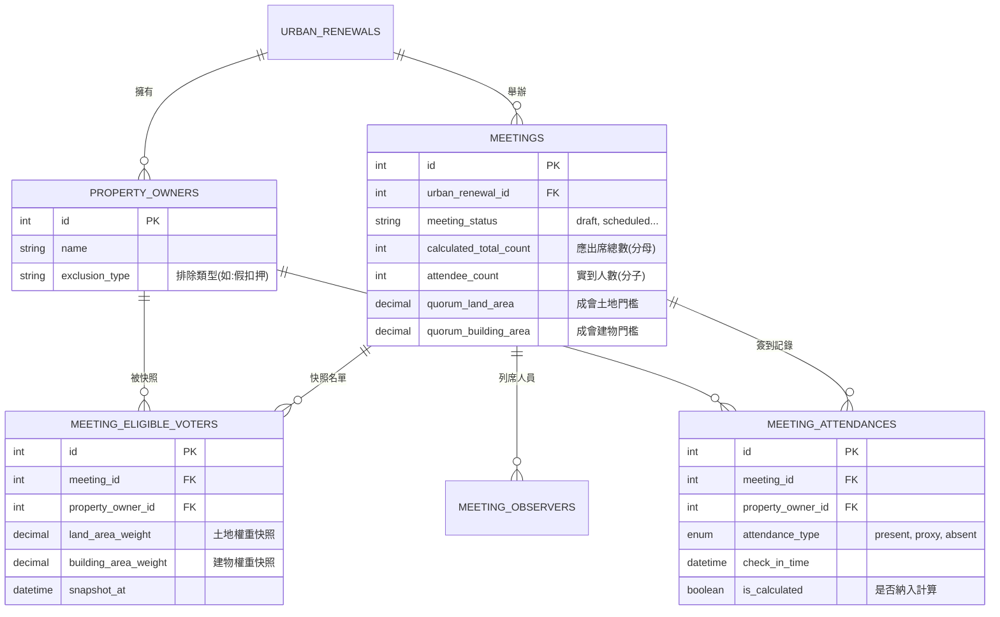

# 會議與報到系統資料庫架構說明

## 1. 系統概述

本文件說明都市更新會管理系統中「會議管理」與「會員報到」模組的資料庫架構與設計邏輯。系統設計核心在於確保會議數據的**一致性**與**不可篡改性**，特別是在處理產權異動頻繁的都更場景中，透過「快照機制」鎖定會議當下的權利狀態。

## 2. 實體關係圖 (ER Diagram)

## 3. 資料表結構詳解

### 3.1 會議主表 (`meetings`)
記錄會議的基本資訊、成會門檻設定以及即時統計數據。

| 欄位名稱 | 類型 | 說明 | 關鍵邏輯 |
| :--- | :--- | :--- | :--- |
| `id` | INT | 主鍵 | |
| `urban_renewal_id` | INT | 外鍵 | 關聯至都市更新會 |
| `calculated_total_count` | INT | **應出席總數** | 依據快照表計算，作為成會比例的分母 |
| `attendee_count` | INT | **實到人數** | 依據報到表計算，作為成會比例的分子 |
| `quorum_*` | - | 成會門檻 | 包含土地、建物面積與人數的分子/分母設定 |

### 3.2 會議合格投票人快照表 (`meeting_eligible_voters`)
**核心表**：用於鎖定會議建立當下的所有權人狀態與權重。

*   **目的**：都更案中土地與建物所有權可能隨時移轉。為了避免會議通知發出後因產權變動導致投票權爭議，系統會在會議建立（或手動更新名單）時，將當下的所有權人及其持分面積「拍照存證」。
*   **權重計算**：`land_area_weight` 與 `building_area_weight` 欄位儲存的是該所有權人名下**所有**土地與建物的持分面積總和。

| 欄位名稱 | 類型 | 說明 |
| :--- | :--- | :--- |
| `meeting_id` | INT | 所屬會議 |
| `property_owner_id` | INT | 原始所有權人ID |
| `land_area_weight` | DECIMAL | **土地權重快照** (總和) |
| `building_area_weight` | DECIMAL | **建物權重快照** (總和) |

### 3.3 會議出席表 (`meeting_attendances`)
記錄實際的報到行為。

| 欄位名稱 | 類型 | 說明 | 關鍵邏輯 |
| :--- | :--- | :--- | :--- |
| `attendance_type` | ENUM | 出席類型 | `present`(親自), `proxy`(委託), `absent`(未出席) |
| `proxy_person` | VARCHAR | 代理人 | 僅在 `attendance_type`='proxy' 時有效 |
| `is_calculated` | TINYINT | 是否納入計算 | 若所有權人有「排除類型」(如假扣押)，此欄位為 0 |

## 4. 關鍵業務邏輯

### 4.1 成會門檻計算 (Quorum Calculation)
成會與否的判斷依據以下公式，且**分母必須固定**：

*   **分母 (Total)**：來自 `meeting_eligible_voters` 表的加總。
    *   總人數 = `COUNT(*)`
    *   總土地面積 = `SUM(land_area_weight)`
    *   總建物面積 = `SUM(building_area_weight)`
*   **分子 (Current)**：來自 `meeting_attendances` 表中已報到 (`present` + `proxy`) 者的對應快照權重。
    *   **注意**：計算分子時，必須回頭去查該出席者在 `meeting_eligible_voters` 中的權重，而不是重新計算其目前的產權。

### 4.2 報到顯示邏輯
報到看板 (`/checkin-display`) 的數據來源：
1.  **應出席 (分母)**：直接查詢快照表 (`meeting_eligible_voters`) 的總和。
2.  **已出席 (分子)**：查詢出席表 (`meeting_attendances`)，並關聯快照表取得對應的面積權重進行加總。
    *   *修正註記*：即使所有權人被標記為 `is_calculated=0` (如假扣押)，只要他在快照名單中且已報到，在報到看板上仍會被計入出席統計，以確保分母與分子的計算基準一致。

### 4.3 資料流向
1.  **建立會議** → 觸發 `createSnapshot` → 寫入 `meeting_eligible_voters`。
2.  **會員報到** → 寫入/更新 `meeting_attendances` → 觸發 `updateAttendanceStatistics` 更新 `meetings` 表的計數快取。
3.  **查看報到看板** → API 讀取 `meeting_attendances` (關聯快照權重) 與 `meeting_eligible_voters` (總數) 進行即時計算。
