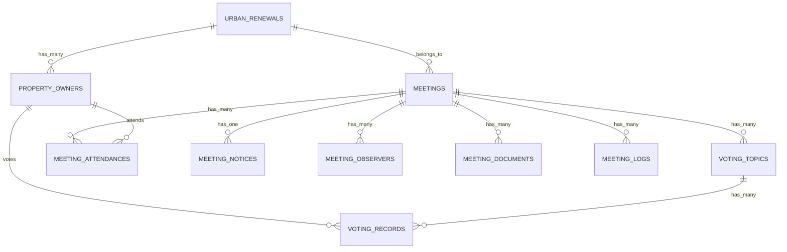

# 都市更新管理系統 - 功能需求與資料庫架構分析

## 系統概述

本系統為完整的都市更新管理平台，涵蓋從更新會成立、會議管理到投票決策的完整流程。系統透過三個主要模組提供全方位的都市更新管理功能。

## 主要模組功能分析

### 1. 更新會管理 (Urban Renewal Management)

#### 核心功能
- **更新會基本資料管理**
  - 新增/編輯/刪除更新會
  - 基本資訊：名稱、土地面積、所有權人數、理事長資料
  - 測試資料自動產生功能

- **地號管理**
  - 詳細地籍資料：縣市、鄉鎮市區、段、小段、地號
  - 支援完整的台灣行政區劃
  - 土地面積與用途管理

- **所有權人管理**
  - 個人基本資料（姓名、身分證、聯絡方式）
  - 土地持分面積與建物面積
  - 批次匯入/匯出功能
  - 分頁顯示與搜尋

#### 頁面路由結構
```
/tables/urban-renewal/
├── index.vue (更新會列表)
├── [id]/
│   ├── basic-info.vue (基本資料編輯)
│   └── property-owners/
│       ├── index.vue (所有權人列表)
│       ├── create.vue (新增所有權人)
│       └── [ownerId]/edit.vue (編輯所有權人)
```

### 2. 會議管理 (Meeting Management)

#### 核心功能
- **會議基本管理**
  - 會議建立與編輯
  - 會議資訊：名稱、日期時間、所屬更新會
  - 出席統計：出席人數、納入計算總人數、列席總人數

- **會員報到系統**
  - 卡片式界面，一列最多10筆資料
  - 報到狀態：親自出席（藍底白字）、委託出席（橘底白字）
  - 即時狀態更新與視覺化
  - 報到結果匯出功能

- **報到顯示統計**
  - 即時時鐘顯示
  - 雙層表格結構：土地、建物、出席人數
  - 統計項目：面積(平方公尺)與比例、人數與比例
  - 分類統計：應出席總數、親自出席數、委託出席數、合計總出席數

- **投票議題管理**
  - 議題列表與基本資料管理
  - 最大有效圈選數、正取數量、備取數量設定
  - 議題狀態追蹤

#### 頁面路由結構
```
/tables/meeting/
├── index.vue (會議列表)
└── [meetingId]/
    ├── basic-info.vue (會議基本資料)
    ├── member-checkin.vue (會員報到)
    ├── checkin-display.vue (報到顯示)
    └── voting-topics/
        ├── index.vue (投票議題列表)
        └── [topicId]/
            ├── basic-info.vue (議題基本資料)
            ├── voting.vue (開始投票)
            └── results.vue (投票結果)
```

### 3. 投票管理 (Voting Management)

#### 核心功能
- **議題選擇與管理**
  - 依更新會與會議日期篩選
  - 會議名稱列表顯示

- **投票執行系統**
  - 網格式投票人介面
  - 二選一投票機制（同意/不同意）
  - 即時投票狀態追蹤
  - 投票取消與重新投票功能

- **投票結果統計**
  - 三維度統計：人數、土地面積、建物面積
  - 百分比與比例計算
  - 排名顯示（同意優先、不同意次之）
  - 詳細的統計報表

#### 頁面路由結構
```
/tables/issue.vue (投票管理-會議選擇)
/tables/voting-topics.vue (投票議題管理)
```

## 物件關係圖

### 核心實體關係


### 業務流程關係
1. **更新會** → **所有權人** → **會議出席** → **投票權重**
2. **會議** → **投票議題** → **投票記錄** → **統計結果**
3. **報到狀態** → **投票資格** → **面積權重計算**

## 詳細功能需求

### 更新會管理功能需求
1. **基本CRUD操作**
   - 新增更新會（含自動測試資料產生）
   - 編輯更新會基本資料
   - 刪除更新會（含確認機制）
   - 列表顯示與分頁

2. **地號管理**
   - 動態縣市鄉鎮選擇
   - 地籍資料完整性驗證
   - 批次地號新增功能

3. **所有權人管理**
   - 個人資料管理
   - 土地建物面積分配
   - 匯入匯出功能
   - 搜尋與篩選

### 會議管理功能需求
1. **會議基本功能**
   - 會議排程管理
   - 與更新會關聯
   - 出席統計自動計算

2. **報到系統**
   - 視覺化報到界面
   - 三種出席狀態管理
   - 即時狀態更新
   - 報到結果匯出

3. **統計顯示**
   - 即時時間顯示
   - 多維度統計計算
   - 面積與人數比例
   - 自動重新計算

### 投票管理功能需求
1. **投票執行**
   - 投票人身份驗證
   - 二選一投票機制
   - 投票狀態即時更新
   - 投票取消與修改

2. **結果統計**
   - 三維度計算（人數、土地、建物）
   - 百分比與比例自動計算
   - 視覺化結果呈現
   - 法定門檻驗證

## 現有資料庫架構分析

### 現有表格結構
根據 `/docs/sql/meeting-management.md` 分析，系統已具備：

1. **核心資料表**
   - `meetings` - 會議基本資料
   - `meeting_attendances` - 出席記錄
   - `voting_topics` - 投票議題
   - `voting_records` - 投票記錄

2. **支援資料表**
   - `meeting_notices` - 會議通知
   - `meeting_observers` - 列席者
   - `meeting_documents` - 會議文件
   - `meeting_logs` - 操作日誌

### 架構優勢
- 完整的外鍵關聯設計
- 豐富的索引配置
- 觸發器自動統計維護
- 審計追蹤機制

## 後端架構專家建議

### 關鍵改進建議

#### 1. 高優先級 - 效能優化
- **複合索引優化**
  ```sql
  -- 會議出席查詢優化
  INDEX idx_meeting_attendance_status (meeting_id, attendance_type, property_owner_id)

  -- 投票統計查詢優化
  INDEX idx_voting_topic_choice_time (voting_topic_id, vote_choice, vote_time)

  -- 面積權重計算優化
  INDEX idx_area_weights (property_owner_id, land_area_weight, building_area_weight)
  ```

- **統計資料快取機制**
  - 會議出席統計預計算
  - 投票結果即時更新
  - 面積權重快取

#### 2. 高優先級 - 安全性強化
- **使用者管理系統**
  ```sql
  CREATE TABLE users (
      id INT PRIMARY KEY AUTO_INCREMENT,
      username VARCHAR(100) UNIQUE NOT NULL,
      password_hash VARCHAR(255) NOT NULL,
      role ENUM('admin', 'chairman', 'member') NOT NULL,
      urban_renewal_id INT,
      is_active BOOLEAN DEFAULT TRUE
  );
  ```

- **操作權限控制**
  - 角色基礎存取控制
  - 會議資料存取限制
  - 投票權限驗證

#### 3. 中優先級 - 資料完整性
- **業務邏輯約束**
  ```sql
  -- 出席狀態邏輯約束
  ALTER TABLE meeting_attendances
  ADD CONSTRAINT chk_proxy_logic
  CHECK (
    (attendance_type = 'proxy' AND proxy_person IS NOT NULL) OR
    (attendance_type != 'proxy')
  );

  -- 投票資格約束
  ALTER TABLE voting_records
  ADD CONSTRAINT chk_voting_eligibility
  CHECK (property_owner_id IN (
    SELECT property_owner_id
    FROM meeting_attendances
    WHERE attendance_type IN ('present', 'proxy')
  ));
  ```

#### 4. 中優先級 - 擴展性準備
- **分表策略**
  - 歷史會議資料分表
  - 大型投票記錄分片
  - 文件儲存外部化

- **效能監控**
  - 查詢效能追蹤
  - 慢查詢優化
  - 資源使用監控

### 缺失功能補強

#### 1. 使用者認證系統
```sql
CREATE TABLE user_sessions (
    id INT PRIMARY KEY AUTO_INCREMENT,
    user_id INT NOT NULL,
    session_token VARCHAR(255) UNIQUE NOT NULL,
    expires_at DATETIME NOT NULL,
    ip_address VARCHAR(45),
    user_agent TEXT,
    created_at DATETIME DEFAULT CURRENT_TIMESTAMP,
    FOREIGN KEY (user_id) REFERENCES users(id)
);
```

#### 2. 系統設定管理
```sql
CREATE TABLE system_settings (
    id INT PRIMARY KEY AUTO_INCREMENT,
    setting_key VARCHAR(100) UNIQUE NOT NULL,
    setting_value TEXT,
    setting_type ENUM('string', 'number', 'boolean', 'json') DEFAULT 'string',
    description TEXT,
    is_public BOOLEAN DEFAULT FALSE,
    updated_at DATETIME DEFAULT CURRENT_TIMESTAMP ON UPDATE CURRENT_TIMESTAMP
);
```

#### 3. 通知系統
```sql
CREATE TABLE notifications (
    id INT PRIMARY KEY AUTO_INCREMENT,
    user_id INT NOT NULL,
    notification_type ENUM('meeting_notice', 'voting_start', 'voting_end', 'system') NOT NULL,
    title VARCHAR(255) NOT NULL,
    message TEXT NOT NULL,
    is_read BOOLEAN DEFAULT FALSE,
    created_at DATETIME DEFAULT CURRENT_TIMESTAMP,
    FOREIGN KEY (user_id) REFERENCES users(id)
);
```

## 資料庫優化建議

### 效能優化策略
1. **查詢優化**
   - 統計查詢使用物化視圖
   - 複雜計算結果快取
   - 分頁查詢效能優化

2. **索引策略**
   - 覆蓋索引設計
   - 複合索引順序優化
   - 無用索引清理

3. **資料生命週期**
   - 歷史資料歸檔
   - 日誌資料定期清理
   - 文件儲存策略

### 擴展性考量
1. **水平擴展**
   - 讀寫分離架構
   - 主從複製配置
   - 負載均衡策略

2. **垂直擴展**
   - 硬體資源優化
   - 記憶體配置調整
   - SSD 儲存優化

## 安全性與合規建議

### 資料保護
1. **個人資料保護**
   - 身分證號加密儲存
   - 個人資料存取記錄
   - 資料匿名化機制

2. **投票資料保護**
   - 投票記錄完整性驗證
   - 防篡改機制
   - 數位簽章驗證

### 審計追蹤
1. **完整操作記錄**
   - 所有CRUD操作記錄
   - 投票操作完整追蹤
   - 系統存取日誌

2. **合規性要求**
   - 法定保存期限管理
   - 資料出入境控制
   - 第三方稽核支援

## 系統架構建議

### 整體架構
```
Frontend (Nuxt 3 + Vue 3)
    ↓
API Gateway
    ↓
Business Logic Layer
    ↓
Data Access Layer
    ↓
Database (MySQL) + Cache (Redis)
```

### 微服務考量
1. **模組化服務**
   - 更新會管理服務
   - 會議管理服務
   - 投票管理服務
   - 使用者認證服務

2. **服務間通訊**
   - RESTful API 設計
   - 事件驅動架構
   - 訊息佇列機制

## 未來發展建議

### 短期目標 (1-3個月)
1. 實施使用者認證系統
2. 優化查詢效能
3. 強化資料完整性約束
4. 建立監控機制

### 中期目標 (3-6個月)
1. 實施快取機制
2. 建立通知系統
3. 優化移動端體驗
4. 建立備份還原機制

### 長期目標 (6-12個月)
1. 微服務架構遷移
2. 雲端部署優化
3. AI 輔助決策功能
4. 區塊鏈投票驗證

## 結論

本系統已具備完整的都市更新管理功能架構，現有資料庫設計良好且考慮周全。主要改進方向應聚焦於：

1. **效能優化** - 透過索引優化和快取機制提升系統響應速度
2. **安全強化** - 建立完整的使用者管理和權限控制系統
3. **功能完善** - 補強通知系統和系統設定管理
4. **合規保障** - 強化審計追蹤和資料保護機制

系統架構設計符合業務需求，具備良好的擴展性和維護性，為都市更新管理提供了穩固的技術基礎。