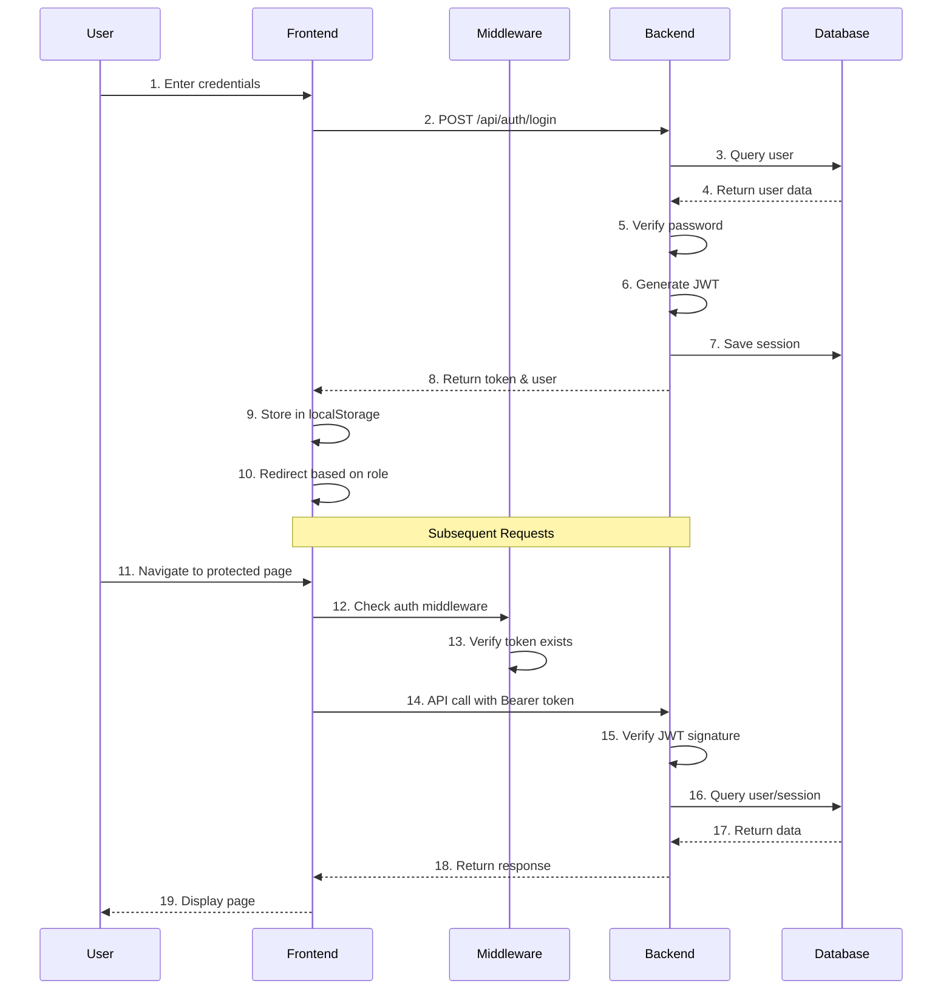

# Implementation Guide: 登入認證功能

**Feature**: 002-login-authentication
**Version**: 1.0.0
**Last Updated**: 2025-10-23
**Target Audience**: Developers

---

## 📚 Document Purpose

本文件提供登入認證功能的詳細實作指南，幫助開發人員了解系統架構、關鍵實作細節和最佳實踐。

---

## 🏗️ Architecture Overview

### System Architecture

```
┌─────────────────────────────────────────────────────────────┐
│                       Browser (Client)                       │
│  ┌─────────────┐  ┌──────────────┐  ┌──────────────┐       │
│  │  Login Page │  │ Auth Store   │  │ useAuth/Role │       │
│  │  (Vue)      │→ │ (Pinia)      │→ │ (Composable) │       │
│  └─────────────┘  └──────────────┘  └──────────────┘       │
└──────────────────────────┬──────────────────────────────────┘
                           │ HTTPS / REST API
                           │ Authorization: Bearer <JWT>
┌──────────────────────────▼──────────────────────────────────┐
│                   Frontend (Nuxt 3)                          │
│  ┌───────────────────┐  ┌─────────────────────────────┐    │
│  │   Middleware      │  │      API Client            │    │
│  │  - auth.js        │→ │  - useApi()                 │    │
│  │  - role.js        │  │  - Auto inject token        │    │
│  └───────────────────┘  └─────────────────────────────┘    │
└──────────────────────────┬──────────────────────────────────┘
                           │ HTTP JSON
┌──────────────────────────▼──────────────────────────────────┐
│                   Backend (CodeIgniter 4)                    │
│  ┌───────────────────┐  ┌─────────────────────────────┐    │
│  │ AuthController    │  │      Models                │    │
│  │  - login()        │→ │  - UserModel                │    │
│  │  - logout()       │  │  - UserSessionModel         │    │
│  │  - refresh()      │  └─────────────────────────────┘    │
│  │  - me()           │                                      │
│  └───────────────────┘                                      │
└──────────────────────────┬──────────────────────────────────┘
                           │ SQL Queries
┌──────────────────────────▼──────────────────────────────────┐
│                    Database (MariaDB)                        │
│  ┌──────────────┐  ┌───────────────┐  ┌─────────────────┐ │
│  │ users        │  │ user_sessions │  │ user_permissions│ │
│  └──────────────┘  └───────────────┘  └─────────────────┘ │
└──────────────────────────────────────────────────────────────┘
```

### Authentication Flow



---

## 🔧 Backend Implementation

### Directory Structure

```
backend/app/
├── Controllers/
│   └── Api/
│       └── AuthController.php       # 認證控制器
├── Models/
│   ├── UserModel.php                # 使用者模型
│   └── UserSessionModel.php        # Session 模型
├── Helpers/
│   ├── auth_helper.php              # 認證輔助函數
│   └── response_helper.php          # API 回應格式化
├── Filters/
│   └── AuthFilter.php               # API 認證過濾器
├── Database/
│   ├── Migrations/
│   │   └── 2025-01-01-000010_CreateUserAuthenticationTables.php
│   └── Seeds/
│       └── UserSeeder.php
└── Config/
    └── JWT.php                      # JWT 配置
```

### Key Files

#### 1. AuthController.php

**Location**: `backend/app/Controllers/Api/AuthController.php`
**Purpose**: 處理所有認證相關的 API 請求

**Key Methods**:

```php
class AuthController extends ResourceController
{
    /**
     * POST /api/auth/login
     * 使用者登入
     */
    public function login()
    {
        // 1. 驗證輸入
        // 2. 查詢使用者
        // 3. 檢查帳號狀態（is_active, locked_until）
        // 4. 驗證密碼
        // 5. 重置登入失敗次數
        // 6. 產生 JWT Token
        // 7. 產生 Refresh Token
        // 8. 儲存 Session
        // 9. 更新 last_login_at
        // 10. 回傳 token 和使用者資料
    }

    /**
     * POST /api/auth/logout
     * 使用者登出
     */
    public function logout()
    {
        // 1. 取得 token from header
        // 2. 標記 session 為失效
        // 3. 回傳成功訊息
    }

    /**
     * POST /api/auth/refresh
     * 刷新 Token
     */
    public function refresh()
    {
        // 1. 驗證 refresh_token
        // 2. 查詢 session
        // 3. 檢查 refresh_token 有效期
        // 4. 產生新的 tokens
        // 5. 更新 session
        // 6. 回傳新 tokens
    }

    /**
     * GET /api/auth/me
     * 取得當前使用者資訊
     */
    public function me()
    {
        // 1. 從 token 取得 user_id
        // 2. 查詢使用者資料
        // 3. 移除敏感資料
        // 4. 回傳使用者資料
    }

    /**
     * 產生 JWT Token
     */
    private function generateJWT($user)
    {
        $payload = [
            'iss' => 'urban-renewal-system',
            'aud' => 'urban-renewal-users',
            'iat' => time(),
            'exp' => time() + 86400, // 24 hours
            'user_id' => $user['id'],
            'username' => $user['username'],
            'role' => $user['role'],
            'urban_renewal_id' => $user['urban_renewal_id']
        ];

        $key = $_ENV['JWT_SECRET'] ?? 'default_secret_key';
        return JWT::encode($payload, $key, 'HS256');
    }
}
```

#### 2. UserModel.php

**Location**: `backend/app/Models/UserModel.php`
**Purpose**: 使用者資料存取和業務邏輯

**Key Features**:
- 自動密碼加密 (`beforeInsert`, `beforeUpdate`)
- 登入失敗追蹤
- 帳號鎖定邏輯
- 使用者搜尋和篩選

```php
class UserModel extends Model
{
    protected $table = 'users';
    protected $allowedFields = [
        'username', 'email', 'password_hash', 'role',
        'urban_renewal_id', 'full_name', 'is_active',
        'last_login_at', 'login_attempts', 'locked_until'
    ];

    protected $beforeInsert = ['hashPassword'];
    protected $beforeUpdate = ['hashPassword'];

    protected function hashPassword(array $data)
    {
        if (isset($data['data']['password'])) {
            $data['data']['password_hash'] =
                password_hash($data['data']['password'], PASSWORD_DEFAULT);
            unset($data['data']['password']);
        }
        return $data;
    }
}
```

#### 3. Helper Functions

**Location**: `backend/app/Helpers/auth_helper.php`

```php
/**
 * 驗證 JWT Token
 */
function verify_jwt($token) {
    $key = $_ENV['JWT_SECRET'] ?? 'default_secret_key';
    try {
        return JWT::decode($token, new Key($key, 'HS256'));
    } catch (Exception $e) {
        return null;
    }
}

/**
 * 從 Header 取得 Token
 */
function get_bearer_token() {
    $header = $_SERVER['HTTP_AUTHORIZATION'] ?? '';
    if (strpos($header, 'Bearer ') === 0) {
        return substr($header, 7);
    }
    return null;
}

/**
 * 檢查使用者權限
 */
function check_permission($user, $permission) {
    // 實作權限檢查邏輯
}
```

### Database Schema

#### users 表

```sql
CREATE TABLE `users` (
  `id` int(11) unsigned NOT NULL AUTO_INCREMENT,
  `username` varchar(100) NOT NULL,
  `email` varchar(255) DEFAULT NULL,
  `password_hash` varchar(255) NOT NULL,
  `role` enum('admin','chairman','member','observer') DEFAULT 'member',
  `urban_renewal_id` int(11) unsigned DEFAULT NULL,
  `property_owner_id` int(11) unsigned DEFAULT NULL,
  `full_name` varchar(100) DEFAULT NULL,
  `phone` varchar(20) DEFAULT NULL,
  `is_active` tinyint(1) DEFAULT 1,
  `last_login_at` datetime DEFAULT NULL,
  `login_attempts` int(11) unsigned DEFAULT 0,
  `locked_until` datetime DEFAULT NULL,
  `password_reset_token` varchar(255) DEFAULT NULL,
  `password_reset_expires` datetime DEFAULT NULL,
  `created_at` datetime DEFAULT NULL,
  `updated_at` datetime DEFAULT NULL,
  `deleted_at` datetime DEFAULT NULL,
  PRIMARY KEY (`id`),
  UNIQUE KEY `unique_username` (`username`),
  UNIQUE KEY `unique_email` (`email`),
  KEY `idx_role` (`role`),
  KEY `idx_is_active` (`is_active`),
  KEY `idx_urban_renewal_id` (`urban_renewal_id`)
) ENGINE=InnoDB DEFAULT CHARSET=utf8mb4;
```

#### user_sessions 表

```sql
CREATE TABLE `user_sessions` (
  `id` int(11) unsigned NOT NULL AUTO_INCREMENT,
  `user_id` int(11) unsigned NOT NULL,
  `session_token` varchar(255) NOT NULL,
  `refresh_token` varchar(255) DEFAULT NULL,
  `expires_at` datetime NOT NULL,
  `refresh_expires_at` datetime DEFAULT NULL,
  `ip_address` varchar(45) DEFAULT NULL,
  `user_agent` text DEFAULT NULL,
  `is_active` tinyint(1) DEFAULT 1,
  `created_at` datetime DEFAULT NULL,
  `last_activity_at` datetime DEFAULT NULL,
  PRIMARY KEY (`id`),
  UNIQUE KEY `unique_session_token` (`session_token`),
  KEY `idx_user_id` (`user_id`),
  KEY `idx_expires_at` (`expires_at`),
  KEY `idx_user_active` (`user_id`, `is_active`),
  FOREIGN KEY (`user_id`) REFERENCES `users` (`id`) ON DELETE CASCADE
) ENGINE=InnoDB DEFAULT CHARSET=utf8mb4;
```

### Environment Variables

```env
# .env
JWT_SECRET=your_super_secret_key_here_change_in_production
JWT_EXPIRY=86400  # 24 hours in seconds
JWT_REFRESH_EXPIRY=604800  # 7 days in seconds

LOGIN_MAX_ATTEMPTS=5
LOGIN_LOCKOUT_TIME=1800  # 30 minutes in seconds
```

---

## 🎨 Frontend Implementation

### Directory Structure

```
frontend/
├── pages/
│   ├── login.vue                    # 登入頁面
│   ├── unauthorized.vue             # 無權限頁面
│   └── test-role.vue               # 角色測試頁面
├── middleware/
│   ├── auth.js                      # 認證 middleware
│   └── role.js                      # 角色權限 middleware
├── stores/
│   └── auth.js                      # Auth Pinia Store
├── composables/
│   ├── useAuth.js                   # 認證 API
│   ├── useApi.js                    # API 請求封裝
│   └── useRole.js                   # 角色權限檢查
└── layouts/
    └── auth.vue                     # 認證頁面 layout
```

### Key Files

#### 1. Auth Store (Pinia)

**Location**: `frontend/stores/auth.js`
**Purpose**: 管理認證狀態

```javascript
export const useAuthStore = defineStore('auth', () => {
  // State
  const user = ref(null)
  const token = ref(null)

  // Getters
  const isLoggedIn = computed(() => !!user.value && !!token.value)
  const isAdmin = computed(() => user.value?.role === 'admin')

  // Actions
  const login = async (credentials) => {
    const { post } = useApi()
    const response = await post('/auth/login', credentials)

    if (response.success) {
      user.value = response.data.user
      token.value = response.data.token

      // Store in localStorage
      if (process.client) {
        localStorage.setItem('auth_token', token.value)
        localStorage.setItem('auth_user', JSON.stringify(user.value))
      }

      return { success: true }
    }
    throw new Error(response.error?.message || 'Login failed')
  }

  const logout = async () => {
    if (token.value) {
      const { post } = useApi()
      await post('/auth/logout')
    }

    user.value = null
    token.value = null

    if (process.client) {
      localStorage.removeItem('auth_token')
      localStorage.removeItem('auth_user')
    }

    await navigateTo('/login')
  }

  const initializeAuth = async () => {
    if (process.client) {
      const savedToken = localStorage.getItem('auth_token')
      const savedUser = localStorage.getItem('auth_user')

      if (savedToken && savedUser) {
        token.value = savedToken
        user.value = JSON.parse(savedUser)
      }
    }
  }

  return { user, token, isLoggedIn, isAdmin, login, logout, initializeAuth }
})
```

#### 2. Auth Middleware

**Location**: `frontend/middleware/auth.js`
**Purpose**: 保護需要認證的頁面

```javascript
export default defineNuxtRouteMiddleware(async (to) => {
  const authStore = useAuthStore()

  // Skip on server
  if (process.server) return

  // Initialize auth state
  await authStore.initializeAuth()

  // Check if logged in
  if (!authStore.isLoggedIn) {
    return navigateTo('/login')
  }

  // Verify token is still valid
  try {
    if (!authStore.user) {
      await authStore.fetchUser()
    }
  } catch (error) {
    return navigateTo('/login')
  }
})
```

#### 3. Role Middleware

**Location**: `frontend/middleware/role.js`
**Purpose**: 檢查角色權限

```javascript
export default defineNuxtRouteMiddleware((to) => {
  const authStore = useAuthStore()
  const requiredRole = to.meta.role

  if (!requiredRole) return

  if (!authStore.user) {
    return navigateTo('/login')
  }

  const userRole = authStore.user.role

  if (Array.isArray(requiredRole)) {
    if (!requiredRole.includes(userRole)) {
      return navigateTo('/unauthorized')
    }
  } else {
    if (userRole !== requiredRole) {
      return navigateTo('/unauthorized')
    }
  }
})
```

#### 4. useRole Composable

**Location**: `frontend/composables/useRole.js`
**Purpose**: 提供角色和權限檢查方法

```javascript
export const useRole = () => {
  const authStore = useAuthStore()

  const hasRole = (roles) => {
    if (!authStore.user?.role) return false
    if (Array.isArray(roles)) {
      return roles.includes(authStore.user.role)
    }
    return authStore.user.role === roles
  }

  const isAdmin = computed(() => hasRole('admin'))
  const isChairman = computed(() => hasRole('chairman'))
  const isMember = computed(() => hasRole('member'))
  const isObserver = computed(() => hasRole('observer'))

  const canManageUrbanRenewal = computed(() => {
    return hasRole(['admin', 'chairman'])
  })

  const canManageMeetings = computed(() => {
    return hasRole(['admin', 'chairman'])
  })

  const canVote = computed(() => {
    return hasRole(['chairman', 'member'])
  })

  const canManageUsers = computed(() => {
    return hasRole('admin')
  })

  return {
    hasRole,
    isAdmin,
    isChairman,
    isMember,
    isObserver,
    canManageUrbanRenewal,
    canManageMeetings,
    canVote,
    canManageUsers
  }
}
```

#### 5. useApi Composable

**Location**: `frontend/composables/useApi.js`
**Purpose**: API 請求封裝，自動加入 token

```javascript
export const useApi = () => {
  const config = useRuntimeConfig()
  const baseURL = config.public.apiBase || 'http://localhost:9228/api'

  const getAuthToken = () => {
    if (process.client) {
      return localStorage.getItem('auth_token')
    }
    return null
  }

  const request = async (url, options = {}) => {
    const token = getAuthToken()

    const headers = {
      'Content-Type': 'application/json',
      ...options.headers
    }

    if (token) {
      headers['Authorization'] = `Bearer ${token}`
    }

    const response = await fetch(`${baseURL}${url}`, {
      ...options,
      headers
    })

    return await response.json()
  }

  const get = (url, options = {}) => {
    return request(url, { ...options, method: 'GET' })
  }

  const post = (url, data, options = {}) => {
    return request(url, {
      ...options,
      method: 'POST',
      body: JSON.stringify(data)
    })
  }

  return { get, post, put, delete: del }
}
```

### Page Protection Example

```vue
<!-- pages/tables/urban-renewal/index.vue -->
<script setup>
// 需要登入 + admin 或 chairman 角色
definePageMeta({
  middleware: ['auth', 'role'],
  role: ['admin', 'chairman']
})
</script>
```

### UI Component Usage

```vue
<!-- 根據權限顯示/隱藏 -->
<template>
  <div>
    <UButton v-if="canManageMeetings" @click="createMeeting">
      新建會議
    </UButton>

    <UButton v-if="canVote" @click="submitVote">
      投票
    </UButton>

    <div v-if="isAdmin">
      <!-- 僅管理員可見 -->
      <UsersManagement />
    </div>
  </div>
</template>

<script setup>
const { isAdmin, canManageMeetings, canVote } = useRole()
</script>
```

---

## 🔒 Security Best Practices

### 1. Password Security

```php
// ✅ Good: Use bcrypt
$hash = password_hash($password, PASSWORD_DEFAULT);
$verified = password_verify($password, $hash);

// ❌ Bad: Plain text or weak hashing
$hash = md5($password);  // DON'T DO THIS
```

### 2. JWT Security

```php
// ✅ Good: Strong secret key
$key = $_ENV['JWT_SECRET'];  // At least 32 characters

// ✅ Good: Set expiration
$payload = [
    'exp' => time() + 86400,  // 24 hours
    'user_id' => $userId
];

// ❌ Bad: No expiration or too long
$payload = ['user_id' => $userId];  // Never expires
```

### 3. SQL Injection Prevention

```php
// ✅ Good: Use Query Builder or Prepared Statements
$user = $this->userModel->where('username', $username)->first();

// ❌ Bad: String concatenation
$query = "SELECT * FROM users WHERE username = '$username'";  // DON'T DO THIS
```

### 4. XSS Prevention

```vue
<!-- ✅ Good: Vue automatically escapes -->
<p>{{ user.full_name }}</p>

<!-- ❌ Bad: v-html without sanitization -->
<p v-html="userInput"></p>  <!-- Dangerous -->
```

### 5. CSRF Protection

```javascript
// ✅ Good: Use CSRF token for state-changing operations
const response = await post('/api/auth/logout', {
  _csrf: csrfToken
})
```

### 6. Rate Limiting

```php
// ✅ Good: Implement rate limiting
if ($loginAttempts >= 5) {
    $lockedUntil = date('Y-m-d H:i:s', time() + 1800); // 30 minutes
    $this->userModel->update($userId, ['locked_until' => $lockedUntil]);
}
```

---

## 🧪 Testing Guide

### Unit Tests

#### Backend Test Example

```php
// tests/unit/AuthControllerTest.php
class AuthControllerTest extends CIUnitTestCase
{
    public function testLoginSuccess()
    {
        $result = $this->controller->login();
        $this->assertEquals(200, $result->getStatusCode());
        $this->assertArrayHasKey('token', $result->getJSON()->data);
    }

    public function testLoginFailure()
    {
        $result = $this->controller->login();
        $this->assertEquals(401, $result->getStatusCode());
    }
}
```

#### Frontend Test Example

```javascript
// stores/auth.spec.js
import { setActivePinia, createPinia } from 'pinia'
import { useAuthStore } from '@/stores/auth'

describe('Auth Store', () => {
  beforeEach(() => {
    setActivePinia(createPinia())
  })

  it('logs in successfully', async () => {
    const store = useAuthStore()
    await store.login({ username: 'admin', password: 'password' })
    expect(store.isLoggedIn).toBe(true)
    expect(store.user.role).toBe('admin')
  })

  it('handles login failure', async () => {
    const store = useAuthStore()
    await expect(store.login({ username: 'admin', password: 'wrong' }))
      .rejects.toThrow()
  })
})
```

### Integration Tests

```bash
# API Integration Test using curl
curl -X POST http://localhost:9228/api/auth/login \
  -H "Content-Type: application/json" \
  -d '{"username":"admin","password":"password"}'

# Expected: 200 OK with token
```

### E2E Tests

```javascript
// tests/e2e/login.spec.js
describe('Login Flow', () => {
  it('allows admin to login and access admin features', () => {
    cy.visit('/login')
    cy.get('input[name=username]').type('admin')
    cy.get('input[name=password]').type('password')
    cy.get('button[type=submit]').click()

    cy.url().should('include', '/tables/urban-renewal')
    cy.contains('更新會管理')
  })
})
```

---

## 🐛 Troubleshooting

### Common Issues

#### Issue 1: Token Not Being Sent

**Symptom**: API returns 401 Unauthorized

**Solution**:
```javascript
// Check if token is in localStorage
const token = localStorage.getItem('auth_token')
console.log('Token:', token)

// Check if token is in request headers
console.log('Request headers:', requestHeaders)
```

#### Issue 2: CORS Errors

**Symptom**: Browser console shows CORS error

**Solution**:
```php
// backend/app/Config/Cors.php
$config['Access-Control-Allow-Origin'] = ['http://localhost:4001'];
$config['Access-Control-Allow-Methods'] = ['GET', 'POST', 'OPTIONS'];
$config['Access-Control-Allow-Headers'] = ['Content-Type', 'Authorization'];
```

#### Issue 3: Token Expired

**Symptom**: User logged out unexpectedly

**Solution**:
```javascript
// Implement token refresh
const refreshToken = async () => {
  const { post } = useApi()
  const response = await post('/auth/refresh', {
    refresh_token: getRefreshToken()
  })

  if (response.success) {
    setAuthToken(response.data.token)
  }
}
```

#### Issue 4: Middleware Not Working

**Symptom**: Unauthorized users can access protected pages

**Solution**:
```vue
<!-- Make sure middleware is defined -->
<script setup>
definePageMeta({
  middleware: ['auth', 'role'],  // Add middleware here
  role: 'admin'
})
</script>
```

---

## 📈 Performance Optimization

### 1. Database Indexing

```sql
-- Add indexes for frequent queries
CREATE INDEX idx_username ON users(username);
CREATE INDEX idx_role_active ON users(role, is_active);
CREATE INDEX idx_session_user ON user_sessions(user_id, is_active);
```

### 2. Query Optimization

```php
// ✅ Good: Select only needed fields
$user = $this->userModel
    ->select('id, username, role, full_name')
    ->where('username', $username)
    ->first();

// ❌ Bad: Select all fields
$user = $this->userModel->where('username', $username)->first();
```

### 3. Caching

```javascript
// Cache user data in memory
const userCache = new Map()

const getUser = async (userId) => {
  if (userCache.has(userId)) {
    return userCache.get(userId)
  }

  const user = await fetchUser(userId)
  userCache.set(userId, user)
  return user
}
```

---

## 🚀 Deployment Checklist

### Pre-Deployment

- [ ] 所有測試通過
- [ ] 程式碼 review 完成
- [ ] 環境變數設定正確
- [ ] JWT Secret 使用強密鑰
- [ ] CORS 設定正確
- [ ] 資料庫 migration 準備好

### Deployment

- [ ] 備份資料庫
- [ ] 執行 migration
- [ ] 部署後端應用
- [ ] 部署前端應用
- [ ] 驗證環境變數
- [ ] 執行煙霧測試

### Post-Deployment

- [ ] 監控日誌
- [ ] 檢查錯誤率
- [ ] 驗證登入功能
- [ ] 檢查效能指標
- [ ] 收集使用者反饋

---

## 📚 Additional Resources

### Documentation
- [spec.md](./spec.md) - 功能規格
- [test-checklist.md](./test-checklist.md) - 測試清單
- [LOGIN_GUIDE.md](../../LOGIN_GUIDE.md) - 使用者指南

### External References
- [JWT.io](https://jwt.io/) - JWT 文件
- [OWASP Authentication](https://cheatsheetseries.owasp.org/cheatsheets/Authentication_Cheat_Sheet.html)
- [CodeIgniter 4 Docs](https://codeigniter.com/user_guide/)
- [Nuxt 3 Docs](https://nuxt.com/docs)

---

**Document Owner**: Tech Lead
**Last Updated**: 2025-10-23
**Version**: 1.0.0
