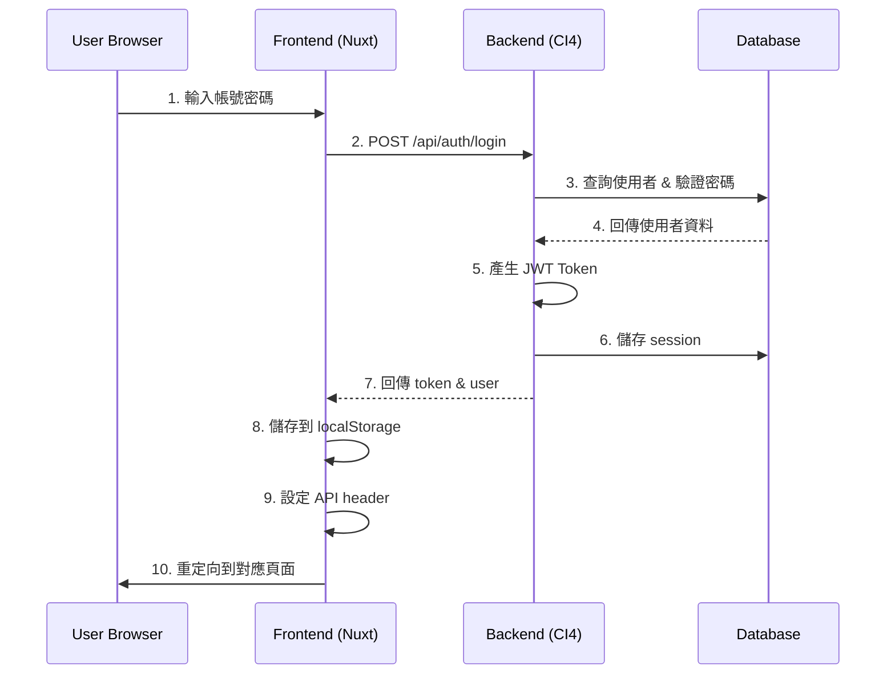

# Feature Specification: 登入認證功能

**Feature ID**: `002-login-authentication`
**Created**: 2025-10-23
**Status**: Active
**Priority**: P0 (Critical)
**Version**: 1.0.0

## 概述

登入認證是都更計票系統的核心安全功能，負責管理使用者身份驗證、授權和 session 管理。本規格定義了兩個主要使用情境：**Admin（管理員）** 和 **User（一般用戶，包括 chairman、member、observer）**。

### 系統架構

```
┌─────────────┐      HTTPS       ┌──────────────┐
│   Browser   │ ◄──────────────► │   Frontend   │
│             │                   │  (Nuxt 3)    │
└─────────────┘                   └──────┬───────┘
                                         │ REST API
                                         │ (JWT)
                                  ┌──────▼───────┐
                                  │   Backend    │
                                  │(CodeIgniter) │
                                  └──────┬───────┘
                                         │
                                  ┌──────▼───────┐
                                  │   MariaDB    │
                                  │  (Database)  │
                                  └──────────────┘
```

## 目標與需求

### 功能目標

1. ✅ **安全的身份驗證**：提供基於 JWT 的安全認證機制
2. ✅ **角色權限管理**：根據使用者角色提供不同的存取權限
3. ✅ **Session 管理**：有效管理使用者登入狀態和 token 生命週期
4. ✅ **安全防護**：防止暴力破解、SQL 注入等攻擊
5. ⚠️ **密碼重設**：提供安全的密碼重設機制（郵件功能待實作）

### 非功能需求

- **效能**：登入回應時間 < 500ms
- **安全性**：符合 OWASP 安全標準
- **可用性**：99.9% 系統可用性
- **擴展性**：支援未來新增 OAuth、SSO 等認證方式

## 使用者角色定義

| 角色 | 英文名稱 | 權限範圍 | 說明 |
|------|---------|---------|------|
| 管理員 | admin | 完整系統權限 | 可管理所有更新會、使用者、系統設定 |
| 理事長 | chairman | 更新會管理權限 | 可管理指定更新會的會議、投票等 |
| 會員 | member | 基本參與權限 | 可參與會議簽到、投票表決 |
| 觀察員 | observer | 唯讀權限 | 僅可查看會議資訊和投票結果 |

## User Stories & Scenarios

### 📌 Story 1: Admin 登入情境 (P0)

**As a** 系統管理員
**I want to** 使用 admin 帳號登入系統
**So that** 我可以管理整個都更計票系統的所有資源和設定

#### Acceptance Criteria

##### ✅ Scenario 1.1: Admin 正常登入
```gherkin
Given 我是系統管理員
  And 我在登入頁面
  And 我有正確的 admin 帳號和密碼
When 我輸入帳號 "admin" 和密碼 "password"
  And 我點擊「登入」按鈕
Then 系統驗證我的身份成功
  And 系統顯示「登入成功，歡迎回來，系統管理員！」訊息
  And 系統儲存 JWT Token 到 localStorage
  And 系統記錄我的登入時間和 IP
  And 系統重定向我到 "/tables/urban-renewal" 頁面
  And 我可以看到管理員專屬的功能選單
```

**驗證重點**：
- ✅ 後端 API 回應包含 user 物件、token、refresh_token
- ✅ user.role === 'admin'
- ✅ Token 儲存在 localStorage ('auth_token')
- ✅ 使用者資料儲存在 localStorage ('auth_user')
- ✅ 導航到更新會管理頁面
- ✅ 資料庫 users 表的 last_login_at 更新

##### ✅ Scenario 1.2: Admin 使用錯誤密碼登入
```gherkin
Given 我在登入頁面
When 我輸入帳號 "admin" 和錯誤密碼 "wrong_password"
  And 我點擊「登入」按鈕
Then 系統驗證失敗
  And 系統顯示「帳號或密碼錯誤」的錯誤訊息
  And 系統記錄登入失敗次數 +1
  And 我仍停留在登入頁面
  And localStorage 中沒有 token
```

**驗證重點**：
- ✅ HTTP 狀態碼 401
- ✅ 回應包含 error 物件
- ✅ 資料庫 users.login_attempts 增加
- ✅ 不產生 token

##### ✅ Scenario 1.3: Admin 帳號被鎖定
```gherkin
Given 我的 admin 帳號已經連續登入失敗 5 次
  And 帳號已被鎖定 30 分鐘
When 我嘗試使用正確密碼登入
Then 系統拒絕登入
  And 系統顯示「帳號已被鎖定，請稍後再試」訊息
  And 我需要等待 30 分鐘或聯繫管理員解鎖
```

**驗證重點**：
- ✅ 檢查 users.locked_until 時間
- ✅ 即使密碼正確也無法登入
- ✅ HTTP 狀態碼 401

##### ✅ Scenario 1.4: Admin Token 過期處理
```gherkin
Given 我已經使用 admin 帳號登入
  And 我的 JWT Token 已經過期（超過 24 小時）
When 我嘗試存取任何需要認證的 API
Then 系統回應 401 Unauthorized
  And 前端 middleware 偵測到 token 過期
  And 系統自動導向登入頁面
  And 系統清除 localStorage 中的 token
```

**驗證重點**：
- ✅ JWT 解碼後檢查 exp 時間
- ✅ Auth middleware 正確攔截
- ✅ 清除舊的認證資訊

##### ✅ Scenario 1.5: Admin 查看完整管理功能
```gherkin
Given 我已使用 admin 帳號登入
When 我進入系統首頁
Then 我可以看到以下功能選單：
  | 功能名稱 | 路由 | 說明 |
  | 更新會管理 | /tables/urban-renewal | 管理所有更新會 |
  | 會議管理 | /tables/meeting | 管理所有會議 |
  | 投票管理 | /tables/issue | 管理所有投票議題 |
  | 使用者管理 | /pages/user | 管理系統使用者 |
  | 系統設定 | /settings | 系統參數設定 |
And 每個功能都可以正常存取
And 不會出現「無權限」訊息
```

**驗證重點**：
- ✅ useRole().isAdmin === true
- ✅ useRole().canManageUrbanRenewal === true
- ✅ useRole().canManageUsers === true
- ✅ 所有管理功能可見且可存取

---

### 📌 Story 2: User 登入情境 (P0)

**As a** 一般使用者（chairman/member/observer）
**I want to** 使用我的帳號登入系統
**So that** 我可以參與都更會議、投票和查看相關資訊

#### Acceptance Criteria

##### ✅ Scenario 2.1: Member 正常登入
```gherkin
Given 我是都更會的一般會員
  And 我在登入頁面
  And 我有正確的會員帳號和密碼
When 我輸入帳號 "member1" 和密碼 "password"
  And 我點擊「登入」按鈕
Then 系統驗證我的身份成功
  And 系統顯示「登入成功，歡迎回來，地主成員1！」訊息
  And 系統儲存 JWT Token 到 localStorage
  And 系統重定向我到 "/tables/meeting" 頁面
  And 我可以看到我有權限參與的會議列表
```

**驗證重點**：
- ✅ user.role === 'member'
- ✅ 導航到會議列表頁面（不是更新會管理）
- ✅ 顯示使用者的 full_name
- ✅ Token 和使用者資料正確儲存

##### ✅ Scenario 2.2: Chairman 登入並管理會議
```gherkin
Given 我是都更會的理事長
When 我使用帳號 "chairman" 登入成功
Then 系統重定向我到 "/tables/meeting" 頁面
  And 我可以看到「新建會議」按鈕
  And 我可以編輯現有會議
  And 我可以管理投票議題
  And 我可以查看會議簽到狀況
But 我無法存取「使用者管理」功能
  And 我無法存取「系統設定」功能
```

**驗證重點**：
- ✅ user.role === 'chairman'
- ✅ useRole().isChairman === true
- ✅ useRole().canManageMeetings === true
- ✅ useRole().canManageUsers === false
- ✅ 導航到 /pages/user 會被重定向到 /unauthorized

##### ✅ Scenario 2.3: Observer 登入唯讀模式
```gherkin
Given 我是都更會的觀察員
When 我使用帳號 "observer1" 登入成功
Then 系統重定向我到首頁 "/"
  And 我可以查看會議資訊
  And 我可以查看投票結果
But 我無法參與投票
  And 我無法編輯任何資料
  And 我無法建立新會議或議題
```

**驗證重點**：
- ✅ user.role === 'observer'
- ✅ useRole().isObserver === true
- ✅ useRole().canVote === false
- ✅ useRole().canManageMeetings === false
- ✅ 所有編輯按鈕被隱藏或禁用

##### ✅ Scenario 2.4: User 權限邊界測試
```gherkin
Given 我使用 member 帳號登入
When 我嘗試直接存取 "/tables/urban-renewal" 頁面
Then 系統檢查我的角色權限
  And 系統發現我不是 admin 或 chairman
  And 系統重定向我到 "/unauthorized" 頁面
  And 頁面顯示「無權限訪問」訊息
  And 我可以點擊「返回首頁」按鈕
```

**驗證重點**：
- ✅ Role middleware 正確攔截
- ✅ 顯示 unauthorized 頁面
- ✅ 不會暴露敏感資料
- ✅ 提供返回導航

##### ✅ Scenario 2.5: User 登出流程
```gherkin
Given 我已使用任何角色的帳號登入
When 我點擊「登出」按鈕
Then 系統調用 /api/auth/logout API
  And 系統清除 localStorage 中的 token
  And 系統清除 localStorage 中的 user 資料
  And 系統將我的 session 標記為失效
  And 系統重定向我到登入頁面
  And 我無法再使用舊的 token 存取 API
```

**驗證重點**：
- ✅ 調用 logout API
- ✅ localStorage 被清空
- ✅ user_sessions.is_active 設為 0
- ✅ 舊 token 無法通過驗證
- ✅ 重定向到 /login

---

## 技術規格

### 認證流程



### API 端點

#### POST /api/auth/login

**Request:**
```json
{
  "username": "admin",
  "password": "password"
}
```

**Response (Success - 200):**
```json
{
  "success": true,
  "data": {
    "user": {
      "id": 1,
      "username": "admin",
      "email": "admin@example.com",
      "role": "admin",
      "full_name": "系統管理員",
      "urban_renewal_id": null,
      "is_active": true,
      "last_login_at": "2025-10-23T12:30:00Z"
    },
    "token": "eyJ0eXAiOiJKV1QiLCJhbGc...",
    "refresh_token": "d6d6ab933d64cb1e568...",
    "expires_in": 86400
  },
  "message": "登入成功"
}
```

**Response (Error - 401):**
```json
{
  "success": false,
  "error": {
    "code": "UNAUTHORIZED",
    "message": "帳號或密碼錯誤"
  }
}
```

### JWT Token 結構

**Payload:**
```json
{
  "iss": "urban-renewal-system",
  "aud": "urban-renewal-users",
  "iat": 1729684800,
  "exp": 1729771200,
  "user_id": 1,
  "username": "admin",
  "role": "admin",
  "urban_renewal_id": null
}
```

**有效期限：**
- Access Token: 24 小時
- Refresh Token: 7 天

### 資料庫表結構

#### users 表
```sql
CREATE TABLE users (
  id INT PRIMARY KEY AUTO_INCREMENT,
  username VARCHAR(100) UNIQUE NOT NULL,
  email VARCHAR(255) UNIQUE,
  password_hash VARCHAR(255) NOT NULL,
  role ENUM('admin', 'chairman', 'member', 'observer') DEFAULT 'member',
  urban_renewal_id INT,
  full_name VARCHAR(100),
  is_active TINYINT(1) DEFAULT 1,
  last_login_at DATETIME,
  login_attempts INT DEFAULT 0,
  locked_until DATETIME,
  created_at DATETIME,
  updated_at DATETIME
);
```

#### user_sessions 表
```sql
CREATE TABLE user_sessions (
  id INT PRIMARY KEY AUTO_INCREMENT,
  user_id INT NOT NULL,
  session_token VARCHAR(255) UNIQUE NOT NULL,
  refresh_token VARCHAR(255),
  expires_at DATETIME NOT NULL,
  refresh_expires_at DATETIME,
  ip_address VARCHAR(45),
  user_agent TEXT,
  is_active TINYINT(1) DEFAULT 1,
  created_at DATETIME,
  last_activity_at DATETIME,
  FOREIGN KEY (user_id) REFERENCES users(id)
);
```

### 前端實作

#### 檔案結構
```
frontend/
├── pages/
│   ├── login.vue                    # 登入頁面
│   ├── unauthorized.vue             # 無權限頁面
│   └── test-role.vue               # 角色權限測試頁面
├── middleware/
│   ├── auth.js                      # 認證 middleware
│   └── role.js                      # 角色權限 middleware
├── stores/
│   └── auth.js                      # Auth Pinia Store
├── composables/
│   ├── useAuth.js                   # 認證相關 API
│   ├── useApi.js                    # API 請求封裝
│   └── useRole.js                   # 角色權限檢查
└── layouts/
    └── auth.vue                     # 認證頁面 layout
```

#### useRole Composable
```javascript
// 角色檢查
const { isAdmin, isChairman, isMember, isObserver } = useRole()

// 權限檢查
const {
  canManageUrbanRenewal,
  canManageMeetings,
  canVote,
  canManageUsers
} = useRole()
```

### 安全機制

| 機制 | 實作方式 | 狀態 |
|------|---------|------|
| 密碼加密 | bcrypt (PHP password_hash) | ✅ |
| Token 簽名 | HMAC-SHA256 | ✅ |
| 登入失敗鎖定 | 5 次失敗鎖定 30 分鐘 | ✅ |
| CORS 保護 | 限制來源網域 | ❌ **需修正 (P0)** - 目前設為 `*` |
| XSS 防護 | 輸入過濾、輸出編碼 | ✅ |
| SQL 注入防護 | Prepared Statements | ✅ |
| CSRF 防護 | Token 驗證 | ❌ **未實作 (P0)** |
| JWT Secret | 環境變數 | ⚠️ **需修正 (P0)** - 有硬編碼 fallback |
| Token 儲存 | localStorage | ⚠️ **需改進 (P1)** - 建議用 httpOnly cookie |
| 密碼強度檢查 | 大小寫+數字+長度 | ⚠️ **未強制 (P1)** - 方法存在但未使用 |
| Session 清理 | 定期清理過期 session | ❌ **未實作 (P1)** |
| 密碼重設 | Token + Email 驗證 | ⚠️ (郵件待實作 P2) |

## 測試帳號

| 角色 | 帳號 | 密碼 | 用途 |
|------|------|------|------|
| Admin | admin | password | 管理員測試 |
| Chairman | chairman | password | 理事長測試 |
| Member | member1 | password | 會員測試 |
| Observer | observer1 | password | 觀察員測試 |

## 驗收標準

### 功能完整性
- ✅ Admin 可以登入並存取所有功能
- ✅ User (chairman/member/observer) 可以登入並存取對應權限功能
- ✅ 登入失敗顯示正確錯誤訊息
- ✅ 帳號鎖定機制正常運作
- ✅ Token 過期後正確處理
- ✅ 登出功能正常運作
- ✅ 角色權限正確限制頁面存取

### 安全性
- ✅ 密碼不會以明文傳輸或儲存
- ✅ Token 有合理的過期時間
- ✅ 無法繞過權限存取受保護資源
- ✅ 登入失敗不洩漏帳號存在資訊
- ✅ Session 管理安全可靠

### 效能
- ✅ 登入回應時間 < 500ms（95th percentile）
- ✅ Token 驗證回應時間 < 100ms
- ✅ 支援併發 100+ 使用者登入

### 可用性
- ✅ 登入介面清晰易用
- ✅ 錯誤訊息明確有幫助
- ✅ 密碼可顯示/隱藏
- ✅ 支援記住登入狀態
- ✅ 登入後自動導向適當頁面

## 已知限制與待改進項目

### 已知限制
1. ⚠️ 密碼重設功能郵件發送未實作
2. ⚠️ 不支援 OAuth/SSO 登入
3. ⚠️ 不支援雙因素認證 (2FA)
4. ⚠️ 不支援帳號註冊功能（需由管理員建立）

### 待改進項目

#### 🔴 Critical (P0) - 安全性修正（來自分析報告 analyze-02.md）
1. **CSRF 保護缺失** - 無 CSRF Token 機制，CORS 設為 `*`
   - 風險：任何網站都可以呼叫 API，存在 CSRF 攻擊風險
   - 工時：2 天
   - 負責：Backend Team + Frontend Team

2. **JWT Secret 硬編碼** - 存在 fallback 值 `urban_renewal_secret_key_2025`
   - 風險：若 .env 未設定，使用已知 secret，Token 可被偽造
   - 工時：0.5 天
   - 負責：Backend Team

#### 🟡 High (P1) - 安全性增強
3. **Token 存在 localStorage** - 有 XSS 風險
   - 建議：改用 httpOnly cookie 或加密 Token
   - 工時：3 天
   - 負責：Full-stack Team

4. **密碼強度未強制** - validatePasswordStrength() 方法存在但未使用
   - 風險：使用者可設定弱密碼
   - 工時：1 天
   - 負責：Backend Team

5. **Session 無清理機制** - 過期 session 會持續累積
   - 影響：資料庫表會越來越大
   - 工時：1 天
   - 負責：DevOps Team

#### 🟢 Medium (P2) - 功能完善
6. **實作密碼重設郵件發送功能**
   - 工時：2 天
   - 負責：Backend Team

7. **實作 refresh token 自動續約**
   - 工時：2 天
   - 負責：Backend Team

#### 🔵 Low (P3) - 未來規劃
8. **加入登入 log 和異常登入偵測**
   - 工時：3 天

9. **支援多裝置登入管理**
   - 工時：3 天

10. **實作雙因素認證 (2FA)**
    - 工時：5 天

11. **支援 OAuth/SSO 登入**
    - 工時：10 天

## 相關文件

- [LOGIN_GUIDE.md](../../LOGIN_GUIDE.md) - 登入功能使用說明
- [contracts/auth.yaml](../001-view/contracts/auth.yaml) - API 契約定義
- [API_TEST_INSTRUCTIONS.md](../../API_TEST_INSTRUCTIONS.md) - API 測試說明

## 變更記錄

| 版本 | 日期 | 變更內容 | 作者 |
|------|------|---------|------|
| 1.0.0 | 2025-10-23 | 初始版本，定義 Admin 和 User 登入情境 | Claude Code |

---

**Last Updated**: 2025-10-23
**Review Status**: ✅ Ready for Testing
**Approver**: _Pending_
